<h1 align=center>Climbing Prediction Model</h1>

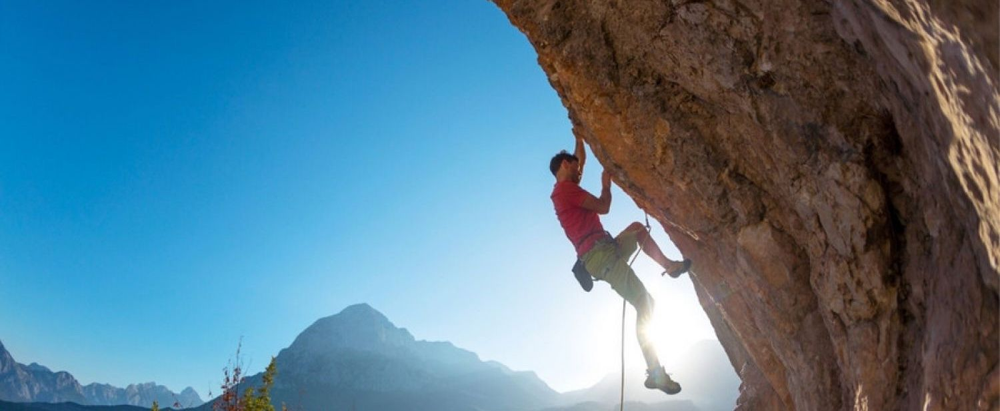

Rock climbing is becoming a more popular sport, with participation in rock climbing steadily increasing every year. Each formation has a rated difficulty, and participants may push themselves to complete climbs of increasing difficulty. 

As climbing hobbyists ourselves, we wanted to build a tool that allows new climbers to project their future success and plan their training frequencies and schedules.

In this project, we train regression models that are able to predict the maximum grade (maximum difficulty) successfully scaled by a rock climber based on various variables, and conclude with a hybrid model which achieves a higher accuracy than previously used models.

> This README provides a brief overview of our project. Our python notebook is annotated in greater detail and explains our thought processes in greater clarity for some of our steps.

## Technologies
* Language: Python with Jupyter Notebook
* Libraries: Numpy, Seaborn, Matplotlib, Sklearn, Scipy
* Machine Learning Models: Logistic Regression, SVM, KNN
* Data Source: <a href="https://kaggle.com">Kaggle.com</a>

## Table of Contents

* [Data Acquisition](#data-acquisition)
* [Problem Formulation](#problem-statement)
* [Exploratory Analysis & Data Cleaning](#exploratory-analysis-and-data-cleaning)
* [Machine Learning](#machine-learning)
* [Limitations](#limitations)

## Data Acquisition
The dataset we will be using for this project is the <a href="https://www.kaggle.com/datasets/jordizar/climb-dataset" target="_blank">Climb Dataset</a> provided by Jordi Zaragoza which provides us with data from individual rock climbers across multiple countries and age groups.

The main dataset, `climber_df.csv` provides us with 10927 rows and 16 columns of data:

Column|user_id|country|sex|height|weight|age|years_cl|date_first|year_first|grades_first|date_last|year_last|grades_last|grades_count|grades_mean|grades_max| 
|-|-|-|-|-|-|-|-|-|-|-|-|-|-|-|-|-
Type|-| Categorical |Categorical |Numerical  |Numerical  |Numerical  |Numerical  |Date       |Numerical  |Numerical  |Date       |Numerical  |Numerical  |Numerical  |Numerical  |Numerical  
Description|-|Country of the user |Biological sex |Height in cm |Weight in kg |Age (in integer years) |"Years climbing" |Date of first recorded climb |Integer year of first recorded climb |Grade of first recorded climb |Date of last recorded climb |Integer year of last recorded climb |Grade of last recorded climb |Number of reported grades |Mean grade of recorded climbs |Highest grade of recorded climbs

### Grade Description
There are 2 main conventions for rating climb difficulty, the Fontainebleau Scale and the V-scale.

|grade_id|Fontainebleau Scale|V-scale|
|-|-|-
|3|1|-
|13|3|VB (Basic)
|29|5|V1
|77|9b|V17

Notably, grade values are sorted based on difficulty, hence we are able to perform scalar predictions on variables that are mapped to `grade_id`.

## Problem Statement

<h4 style="text-align:center;"> Given the <ins>initial state</ins> of a rock climber, we wish to predict the <ins>highest difficulty</ins> that they will achieve in <ins>the future</ins>.</h4>

<br> 

* **Initial State (Predictor)**

    This "initial state" includes variables known at the time of prediction. **Assuming a climber has already completed his first climb**, we have:

    ```
    date_first, year_first, grade_first, country, sex, height, weight, age
    ```
    > As a secondary goal, we also aim to generalise this initial state such that it is applicable to as many rock climbers as possible.

* **Future State (Predictor)**  

    We define a future state based on:
    * Number of climbs done since the initial state, `grades_count`
    * Years since the first climb, `years_cl`
    * Years spent actively climbing, `date_last` and `year_last`  
<br>
    ```
    grades_count, years_cl, date_last, year_last
    ```

<br>

* **Highest difficulty (Response)**
    
    Our response variable is represented by `grades_max` which represents the highest-graded climb completed, and  can be treated as a scalar variable.

<br>

## Exploratory Analysis and Data Cleaning
We performed exploratory analysis on key variables and create new variables to represent combinations of related features.

This README presents a brief overview of changes we have made on the dataset; Further explanation and details may be found in the actual notebook.

* [Grades](#grades)
* [Country](#country)
* [Height and Weight](#height-and-weight)
* [Climbing Durations](#climbing-durations)
* [Age](#age)
* [Outliers](#Outliers)
* [Final Correlation](#final-correlation)

### Grades

Our dataset provides 4 main grade variables:
* `grades_count`
* `grades_first`
* `grades_last`
* `grades_mean`
* `grades_max`, our response variable

We discarded  `grades_mean` and `grades_last` as **these variables are not known at the time of prediction**, which assumes that a climber has only completed their first climb.

### Country
We found that the interquartile range of climbers varied significantly between countries. However, the feature was represented by unordered 3-character strings, and many countries originated from the EU.

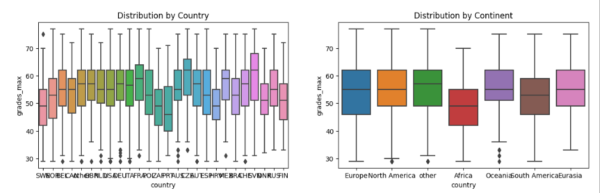

**In order to generalise our model**, we performed the following steps:
1. Disregarded the individual countries and grouped them by continent
1. Re-encoded countries as integers, sorted by mean

Grouping by continent, every continent had sufficient data to form a normal distribution (by the Central Limit Theorem), and the disparity in interquartile ranges was still preserved.

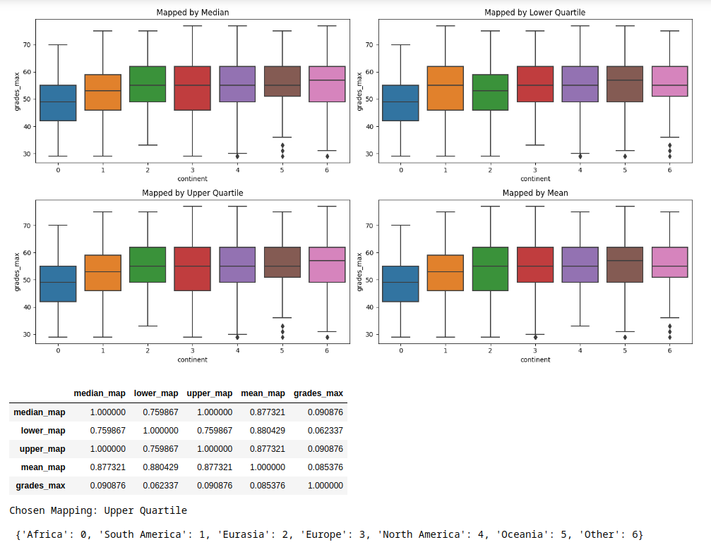

### Height and Weight
We used height and weight to obtain Body Mass Indicator (BMI) as such:

$BMI = \frac{weight/kg}{[height/m]^2}$

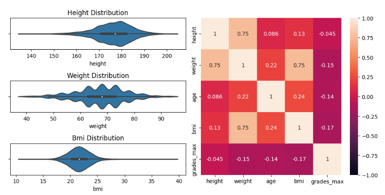

We found that the correlation of `bmi` with `grades_max` improved from the original height and weight correlation, suggesting that BMI was a useful transformation on the raw values of height and weight.

### Climbing Durations
`years_cl` was described by the dataset author as the number of "years climbing". However, this information was ambiguous: "Years climbing" could have referred to the number of years spent climbing regulary, or the number of years since their first climb 

We converted `years_cl` to `days_cl` with the approximation: $days\_climbed = years\_climbed*365$ Taking the difference between `date_first` and `date_last` (We name this variable `days_diff`) allowed us to obtain another measure of days spent climbing which had a vastly different distribution from `years_cl`.

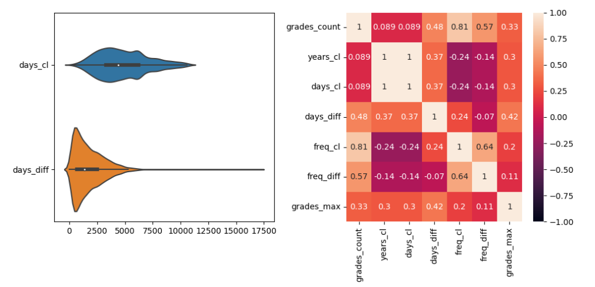<br>

It was noticed that `date_first` and `date_last` were sometimes reversed, so an abs() function was performed to fix this issue. Additionally, some values of `days_diff` were larger than `years_cl` despite the fact that `days_diff` should have been upper bounded by `years_cl`.

`days_diff` had a significantly higher correlation to our response variable, so we chose to discard `years_cl` and use `days_diff` instead.

### Age
The initial correlation of `age` was extremely low. 

We subtracted `years_cl` from `age` **with the asssumption that `years_cl` represents the number of years since an individual has started climbing**, hence obtaining `start_age`, the starting age of the climbers.

$start\_age = age-years\_cl$

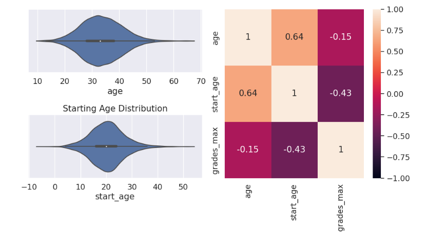<br>

This variable followed a normal distribution, and also had a significant correlation to `grades_max`. `start_age` also revealed that some values of `age` could be erroneous are infeasible as they led to negative starting ages. This is likely because `years_cl` contains erroneous data:
1. Individuals might have reported the age that they started climbing instead of their current age
2. Data could have been incorrectly recorded

### Outliers

* We observed significant skew for certain features `grades_count` and `days_diff`, which suggested that later applying a logarithmic transformation to those features would better normalise its data.

We identified the following outliers in our features:
1. As mentioned earlier, some values of `start_age` were completely infeasible as they were below or equal to 0.
2. As mentioned earlier, some values of `days_diff` appeared erroneous as they were significantly larger than the `years_cl` variable.
3. The `continent` feature contains an additional "Other" value that was mapped to the highest numerical value. It was uncertain what this "Other" column represented.

These anomalies were removed as it was unclear how to interpret their data.

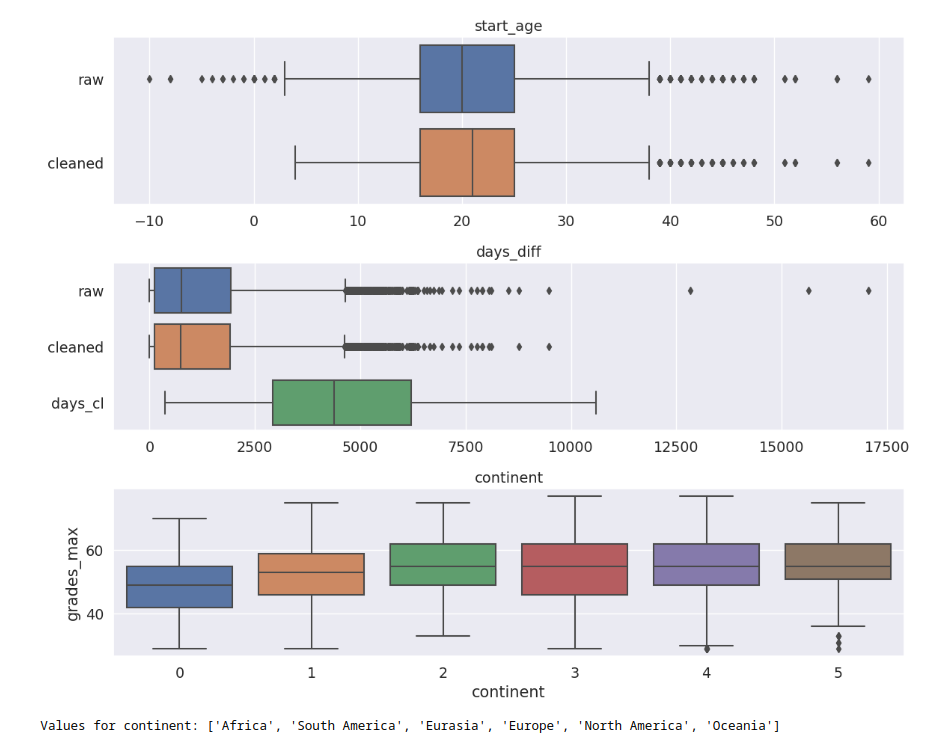<br>

Although other outliers for other features were present, it is likely that they are true outliers:
* Outliers in biometric data appear feasible and could provide our model with useful datapoints for extreme body types
* Rock climbing is a competitive sport and professionals can train multiple times a week and complete multiple climbs a day. Additionally, the aforementioned right skew for `grades_count` and `days_diff` distributions meant that applying the IQR outlier metrics to its data could have been unsuitable.

### Summary
A final review of our changes to the dataset:
* `grades_last` and `grades_mean` were alternative response variables and would not be used
* `country` was generalised to `continent`
* `bmi`, `start_age` and `days_diff` were added
* Erroneous data was removed

## Machine Learning
We performed an initial linear regression, and used it to hypertune exponents for our features. Next, we used these exponents to train Support Vector Machine and K-Nearest Neighbour models, and compared their results
* [Linear Regression](#linear-regression)
* [Support Vector Machine (SVM)](#support-vector-machine)
* [K-Nearest-Neighbours (KNN)](#k-nearest-neighbours)
* [Hybrid Model](#hybrid-model)
### Linear Regression
Performing linear regression on the current variables gives an R^2 value of 0.71, and an MSE of 26.

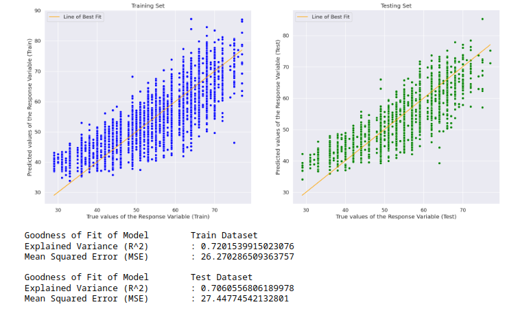<br>

We observed that a slight curvature in both graphs, which confirmed that the Linear Regression Model did not account for the non-linearity of provided features.

Hence, we had to obtain suitable transformations for our variables to linearize their relationships.

#### Hypertuning Parameters
To improve the linear regression, we plotted explained variance against varying exponent transformations for individual features:

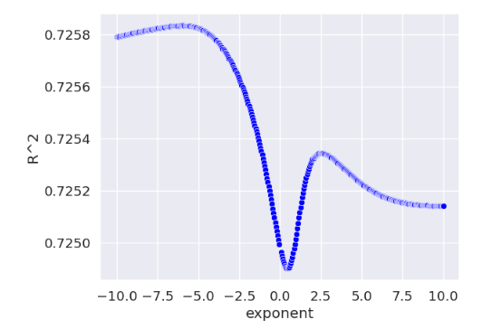
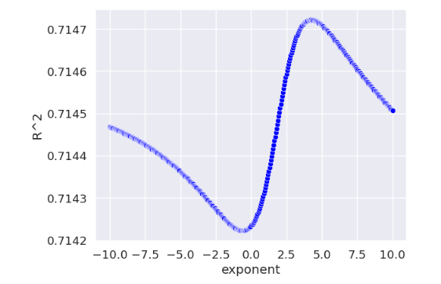

> Resulting curves for BMI and Height respectively

We used these curves to obtain an optimal value for exponent that would maximise the accuracy of our model. Obtaining these values for all of our predictors gave a list of exponents that could be applied to our variables.

We observed that:
1. Exponents for `days_diff` and `grades_count` were logarithmic and strongly reflected our initial observations about their skew
2. `grades_first` had an exponent close to 1. This was expected as it was graded on the same scale as `grades_max`.
3. This method of exponent-finding did not work well on categorical variables such as sex and continent, and we hence restored the exponents of these features back to 1.

Applying our obtained exponent values, renormalising and performing linear regression significantly improved our model:

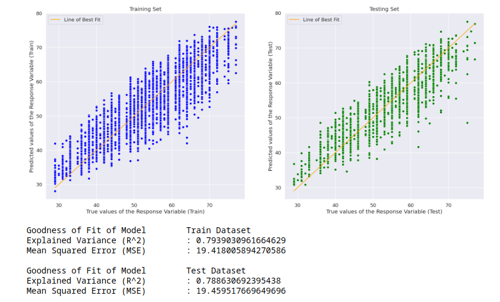<br>

* The distribution of values were visibly more linear than our previous regression
* The logistic regression still appeared to be poor in predicting `grades_max` in the range of 30-40, with most data points falling above the optimal line. 
* The model appeared prone to underestimating `grades_max` values in the intermediate range as well.

The exponents obtained in this step were reused for subsequent SVM and KNN models.

### Support Vector Machine

We used the Linear SVM model (which does not utilise the kernel trick) as it is suitable for larger datasets with fewer features.

* The R^2 and MSE values of our model had noticeably improved from our logistic regression. 
* The model appeared to outperform logistic regression in the midrange values for `grades_max`

### K-Nearest Neighbours
* KNN gave us the best R^2 and MSE values among the three models trained
* However, the model appeared to be poor at predicting low and high values of `grades_max`. This was likely due to KNN relying on neighbouring data points to predict values: Extreme values of `grades_max` likely corresponded to data outside of the interquartile range that are sparse by nature

### Hybrid Model
To summarise our findings from the previous section:
1. Linear Regression provided us with suitable transformations for our variables
2. SVM was more accurate than Logistic Regression
3. KNN was the most accurate model for standard datapoints but failed to accurately predict datapoints outside of the interquartile range

Hence, we decided to build a hybrid model of SVM and KNN:
1. SVM is the most accurate model for extreme datapoints, therefore we apply it first to identify those points
2. The KNN model is then applied to the remaining datapoints to provide a more accurate prediction for those datapoints

Doing so rewarded us with our most accurate model that achieved an expained variance (R^2) of 82.4%

## Limitations

We can explain the remaining variance in our final model in several ways:
1. It is unclear when the biometric data of each individual is taken. Young climbers may increase in height over time, and inactive climbers may gain weight, which could explain the low correlations between `grades_max` and biometrics.
2. `days_diff` and `grades_count` only guarantee training duration and frequency, but do not guarantee intensity. Climbers who actively challenge themselves to more difficult climbs might outperform their peers which would not be reflected by our current metrics.
3. Our dataset concerns outdoor climbers, and may not consider the frequency of indoor trainings that might influence the future performance of a climber.
4. In our outlier removal step, we observed a discrepancy in reporting of `age` and `years_cl` which was addressed by filtering out individuals who had infeasibly low starting ages (<=3 years old), but this may not have removed all erroneous data. This is likely, considering the skew in `start_age` which is a variable one would expect a normal distribution on.

Additionally, it is surprising that KNN outperforms SVM when predicting values within the interquartile range. This project demonstrates the feasibility and relevance of basic models even with the introduction of newer models like SVM and neural networks.
