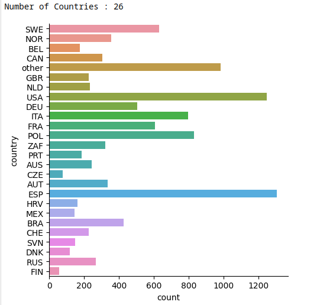

<style>
h1{ text-align:center; }
h2{ text-align:center; }
</style>
# Climb Dataset

Rock climbing is a popular sport that involves participants scaling natural rock formations or artifical rock walls. Each formation has a rated difficulty, and participants may push themselves to complete climbs of increasing difficulty.

In this project, we intend to train regression models that are able to predict the maximum grade (maximum difficulty) successfully scaled by a rock climber based on various variables.

## Table of Contents
* [Data Acquisition](#data-acquisition)
* [Problem Formulation](#problem-statement)
* [Exploratory Analysis & Data Cleaning](#exploratory-analysis-and-data-cleaning)
* [Machine Learning](#machine-learning)
    * [Linear Regression](#linear-regression)
    * [K Nearest Neighbours (KNN)](#k-nearest-neighbours)
    * [Support Vector Machines (SVM)](#support-vector-machines)
* [Conclusions](#conclusions)
* [Considerations](#considerations)

## Data Acquisition
The dataset we will be using for this project is the <a href="https://www.kaggle.com/datasets/jordizar/climb-dataset" target="_blank">Climb Dataset</a> provided by Jordi Zaragoza which provides us with data from individual rock climbers across multiple countries and age groups.

The main dataset, `climber_df.csv` provides us with 10927 rows and 16 columns of data:

Column|user_id|country|sex|height|weight|age|years_cl|date_first|year_first|grades_first|date_last|year_last|grades_last|grades_count|grades_mean|grades_max| 
|-|-|-|-|-|-|-|-|-|-|-|-|-|-|-|-|-
Type|-| Categorical |Categorical |Numerical  |Numerical  |Numerical  |Numerical  |Date       |Numerical  |Numerical  |Date       |Numerical  |Numerical  |Numerical  |Numerical  |Numerical  
Description|-|Country of the user |Biological sex |Height in cm |Weight in kg |Age (in integer years) |"Years climbing" |Date of first recorded climb |Integer year of first recorded climb |Grade of first recorded climb |Date of last recorded climb |Integer year of last recorded climb |Grade of last recorded climb |Number of reported grades |Mean grade of recorded climbs |Highest grade of recorded climbs

### Grade Description
There are 2 main conventions for rating climb difficulty, the Fontainebleau Scale and the V-scale.

|grade_id|Fontainebleau Scale|V-scale|
|-|-|-
|3|1|-
|13|3|VB (Basic)
|29|5|V1
|77|9b|V17

Notably, grade values are sorted based on difficulty, hence we are able to perform scalar predictions on variables that are mapped to `grade_id`.

## Problem Statement

<h4 style="text-align:center;"> Given the <ins>initial state</ins> of a rock climber, we wish to predict the <ins>highest difficulty</ins> that they will achieve in <ins>the future</ins>.</h4>

<br> 

* **Initial State (Predictor)**

    This "initial state" includes variables known at the time of prediction. **Assuming a climber has already completed his first climb**, we have:

    ```
    date_first, year_first, grade_first, country, sex, height, weight, age
    ```
    > As a secondary goal, we also aim to generalise this initial state such that it is applicable to as many rock climbers as possible.

* **Future State (Predictor)**  

    We define a future state based on:
    * Number of climbs done since the initial state, `grades_count`
    * Years since the first climb, `years_cl`
    * Years spent actively climbing, `date_last` and `year_last`  
<br>
    ```
    grades_count, years_cl, date_last, year_last
    ```

<br>

* **Highest difficulty (Response)**
    
    Our response variable is represented by `grades_max` which represents the highest-graded climb completed, and  can be treated as a scalar variable.

<br>

## Exploratory Analysis and Data Cleaning
In this section, we perform exploratory analysis on key variables and create new variables to represent combinations of related features.

* [Initial Correlation](#initial-correlation)
* [Grades](#grades)
* [Country](#country)
* [Biometric Data](#biometric-data)
* [Climbing Durations](#climbing-durations)
* [Outliers](#Outliers)
* [Final Correlation](#final-correlation)

### Initial Correlation

A preliminary check of the correlations between values of the dataset results in the following heatmap:


We observe a few expected correlations:
* `height` and `weight` are closely correlated, and gender is inversely correlated to both due to females being generally shorter and lighter than males
* `age` and `years_cl` are directly correlated, since years spent climbing is upper bounded by the age of the individual  
* It is also interesting to note that `grades_first` is highly correlated to `grades_max`. This could be due several reasons:
    * Having a higher first grade is a strong indicator of confidence and one is thus likely to attempt climbs of higher difficulty
    * Some individuals could have climbed very few times, thus their first grade climbed is equal or close to their maximum grade achieved.

The correlation between `grades_max` and our other discussed variables is generally low, and they must be improved to achieve useful results.

### Grades

Our dataset provides 4 main grade variables:
* `grades_count`
* `grades_first`
* `grades_last`
* `grades_mean`
* `grades_max`, our response variable

It would be unfair to include `grades_mean` and `grades_last` into our predictor variables as **these variables are not known at the time of prediction**, which assumes that a climber has only completed their first climb.

<br>

We also find that `grades_max` is relatively well distributed and generally follows a normal distribution:
1. The lowest grade has a `grade_id` of 29, which is a difficulty of 5 on the Fontainebleau Scale, which translates to a relatively easy climb for beginners.
3. The average grade has a `grade_id` of 56, which is a difficulty of 7b+/7c on the Fontainebleau Scale and translates to a challenging climb, even for avid climbers
2. The highest grade has a `grade_id` of 77, which is a 9b on the Fontainebleau Scale and well within the difficulty range of professional climbers


### Country
First, we observe that:
1. Data for this column is categorical and is stored as 26 unique unordered 3-character strings (eg. ESP, POL)
2. Most data is collected from Europe
3. There is a substantial difference in median, upper and lower quartiles of `grades_max` between countries in which could be useful
4. Grouping data by continent also reflects significant differences in distribution of `grades_max`




In the case of Finalnd and the Czech Republic, the number of data points is extremely small which suggests that directly training our model on this country data could put the model at risk of overfitting.

Additionally, **we wish to generalise our model such that it is applicable to as many rock climbers as possible**. If our model was directly trained on these countries, it would be inapplicable to climbers who reside in countries outside of our dataset. 

Therefore, we perform the following steps:
1. Disregard the individual countries and group them by continent
1. Re-encode countries as integers
2. The order of encoding is based on some indicator (mean, upper quartile, lower quartile, median)

Grouping by continent, every continent has sufficient data to form a normal distribution (by the Central Limit Theorem). Hence this grouping is sufficient.

We select **mean** as the most representative indicator due to its highest correlation, and map continents to numerical values.


### Biometric Data
We are provided 3 variables representing biometric data: `height`, `weight` and `age`.

First, we observe that:
1. Data is scalar and stored as integers for all 3 variables
2. Plotting their distributions give relatively balanced normal distributions:
  * The distribution of weight is slightly odd, but still follows a bell-curve shape. The 'wavelike' shape of its distribution could be from rounding errors when reporting the weight of each climber
3. Running a correlation heatmap gives us relatively low correlation to all 3 variables

### Height and Weight
As suggested by the initial correlation heatmap, height and weight are closely related features. In fact, we can use both variables to obtain Body Mass Indicator (BMI) as such:

$BMI = \frac{weight/kg}{[height/m]^2}$


We see that the correlation of `bmi` with `grades_max` has improved from the original height and weight correlation, suggesting that BMI is a useful transformation on the raw values of height and weight.

### Age
It is observed that the correlation of `age` is extremely low. 

**Asssuming that `years_cl` represents the number of years since an individual has started climbing**, subtracting `years_cl` can give us the age that an individual started climbing.

$start\_age = age-years\_cl$

<br>

This allows us to obtain `start_age` which follows a normal distribution, and also has a significant correlation to `grades_max`. `start_age` also reveals that some values of `years_cl` are infeasible as they are larger than current reported age. This suggests **there is erroneous data that must be removed later**.

### Climbing Durations
`years_cl` is described by the dataset author as the number of "years climbing". However, this information is insufficient:
1. "Years climbing" may refer to the number of years spent climbing regulary, or the number of years since the first climb (The climber may no longer be active). It is assumed when calculating `start_age` that it refers to the latter.
2. We can convert `years_cl` to `days_cl` with the approximation: $days\_climbed = years\_climbed*365$
3. Taking the difference between `date_first` and `date_last` (We name this variable `days_diff`) gives another measure of days spent climbing which has a vastly different distribution from `years_cl`.
4. We can also obtain the frequency that the climber did climbs while he was active using the formula:  
   $frequency=\frac{grades\_count}{number\_of\_days}$


<br>

It was noticed that `date_first` and `date_last` are sometimes reversed, so an abs() function was performed to fix this issue. Additionally, some values of `days_diff` are larger than `years_cl` which suggests **there is erroneous data that must be removed later**.

* `days_diff` has a far stronger correlation to `grades_max` than `days_cl`
* Both versions of frequency have a lower correlation to `grades_max` than their original variables

In our original problem statement, `days_diff` and `days_cl` both describe a future state and are hence mutually exclusive variables. **Therefore, we will use `days_diff` instead of `years_cl` for subsequent model training.**

### Outliers

Having added relevant predictors to our model, we can now remove outliers for our variables:
1. As mentioned earlier, some values of `start_age` are completely infeasible as they are below or equal to 0. This is possibly due to individuals reporting their age at the time of their first climb instead of their current age.
2. As mentioned earlier, some values of `days_diff` appear erroneous as they are significantly larger than the `years_cl` variable.
3. `continent` contains an additional "Other" value that is mapped to the highest numerical value. It is uncertain what this "Other" column might represent.

These anomalies must be removed from the data as it is unclear how they should be otherwise interpreted.

<br>

> We remove any `start_age` less than 4 as it is nearly physically impossible to start climbing at those ages

### Correlation Heatmap
A final review of our changes to the dataset:
* `grades_last` and `grades_mean` are alternative response variables and will not be used
* `country` has been generalised to `continent`
* `bmi`, `start_age` and `days_diff` have been added
* Erroneous data has been removed

With these changes, we can build a final correlation heatmap and scatterplot to visualise our features' correlation to `grades_max`.

<br>
<br>

## Machine Learning
In this section, we do an initial linear regression, and subsequently use it to find optimal exponents for our variables. Next, we normalise our data and use them ot train K-Nearest-Neighbours and Support Vector Machine models.
* [Linear Regression](#linear-regression)
* [Support Vector Machine (SVM)](#support-vector-machine)
* [K-Nearest-Neighbours (KNN)](#k-nearest-neighbours)

### Linear Regression
Performing linear regression on the current variables gives an R^2 value of 0.71, and an MSE of 26.

<br>

We can also observe that there is a slight curvature in both the graph of the training set and testing set, where there are more data points below the line of best fit.

This implies that the Linear Regression Model fails to account for the non-linearity of provided features, and exponents may be applied to improve this behaviour.

#### Hypertuning Parameters
To improve the linear regression, we can explore the effect of varying exponents on each variable. Plotting explained variance against exponent for different features provides us with interesting results:


> Resulting curves for BMI and Height respectively

We can observe visually that there exists an optimal value for exponent that maximises the accuracy of our model. Obtaining these values for all of our predictors gives a list of exponents that can be applied to our variables.

> It is important to normalise the data to unit variance for this step as applying exponents can cause a variable to become overpower the linear regression model.

Another observation is that this method of exponent-finding does not work well on categorical variables such as sex and continent:


<br>

Hence, we intentionally restore the exponents of these features back to 1.


Applying our obtained exponent values, renormalising and performing linear regression provides us with a significantly improved model:

<br>

The distribution of values are visibly more linear than our previous regression, suggesting that the features are more accurately represented with the exponents applied.

These parameters are reused for subsequent SVM and KNN models.

### Support Vector Machine

We can apply SVM with a linear kernel on our tuned dataset to achieve a significantly more accurate model:

<br>
